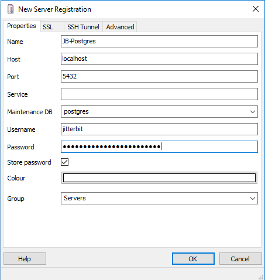
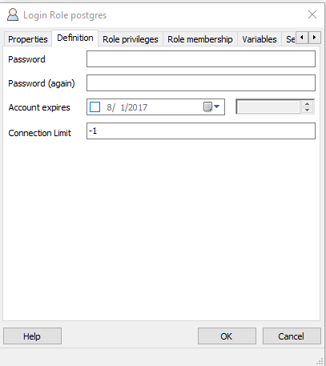

# List Types

Here are guidelines for bulleted lists and numbered lists.

## Bulleted Lists

When the order of items isn't important, use an unordered or bulleted list. Alphabetize or use another order, but carry the consistency over to other lists. For example, Cloud Studio lists a connector's activity in a specific order.

Bulleted lists should have:

* A complete lead-in sentence with a colon 
* More than one list item
* Up to two levels of lists
* Parallel sentence construction
* One idea for each list item
* A period or other punctuation if the list items are complete sentences

Here is an example of a bulleted list:  
The following example of a bulleted list contains a complete lead-in sentence. Each item in the list uses parallel construction and doesn't contain more than one phrase.

In addition, users with an expired subscription have these permissions:
* View the list of projects from the project index.
* Open projects to view within the project designer.
* View project and component configuration screens (for example, connection/activity, transformation, script).

## Numbered Lists

When order is important, use ordered, or numbered lists. They're also called procedural lists.

Numbered lists should have:

* A complete lead-in sentence with aperiod or a colon
* More than one list item
* Up to two levels of lists
* Parallel sentence construction
* One action for each item

Here is an example of a numbered list for a procedure:

1. Launch PGAdmin.

2. Click **File** and select **Add Server**.

3. Enter a **Name** for the connection.

4. Change the **Username** from `postgres` to `jitterbit`.

5. Populate the **Password** found in the `[DbInfo]` section of the `Jitterbit.conf` file.

6. Optional: Set **Colour**, if desired.

7. Click **OK**.  

 
 
8. Once the connection has been created, expand the **New Connection** and expand **Login Roles**.

    a. Select **Properties** for the **postgres user**.
    
    b. Click the **Definition** tab.
    
    c. Enter a new **Password**.
    
    d. Click **OK**.  
    
 

