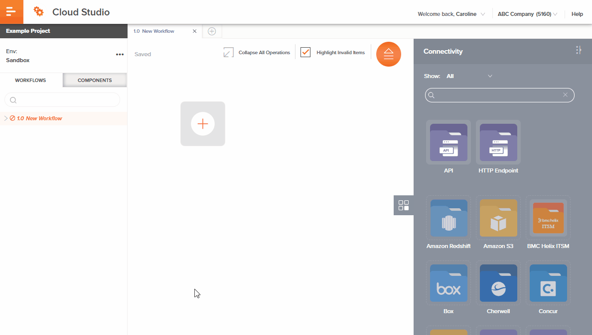

# Image Types

We use these type of images in Jitterbit documentation:

* Product screenshots
* Conceptual and workflow diagrams
* GIFs illustrating a process
* Inline images or UI elements.

## Product Screenshots
Use screenshots for task information. They're also useful in troubleshooting topics.

A good example of a screenshot is at <a href="https://success.jitterbit.com/display/CS/Amazon+S3" target="_blank">Amozon S3 Connector</a>.

## Conceptual and Workflow Diagrams
Use diagrams show complex system architecture, workflows, Jitterbit processes, and transformation types. While they should never replace
text, they are an effective way to help users understand complex material.

<a href="https://success.jitterbit.com/display/CS/Operation+Validity" target="_blank">Validity Patterns in Operation Validity</a> has excellent examples of diagrams and workflows.

## GIFs Illustrating a Process
You can use an animated GIF to show a process, such as creating a Cloud Studio activity. They're and effective way of enhancing a
text discription.

See the following example of an animated GIF:

Inline images
We use inline images to show what a UI element, such as an icon, button, or command element.

See the following example of an inline image:

> Click the  Refresh icon or the word Refresh to reload objects from the Snowflake endpoint. This may be useful if you have recently added objects to the Snowflake instance. This action refreshes all metadata used to build the table of objects displayed in the configuration.